# ИНСТРУКЦИЯ

Данная инструкция поможет вам установить компилятор **как для C++**, так и для **Python**, а также настроить VS Code так, чтобы всё заработало с первого раза (ну… или почти 😄).

---

[RU](#инструкция) / [EN](#instruction)

---

## 1. Распаковываем архив

> Скачиваем .zip архив **"Гайд по C++"**, который можно взять по ссылке:  
> <https://disk.yandex.ru/d/3oVxqH7gDGZTqg>

После скачивания:

- Переносим папку **mingw64** в **[корень диска](#корень-диска)**

## 2. Переносим папку c проектом

Папку проекта можно перенести **куда угодно**, но [путь](#путь) должен быть на английском. (папка `your project`)

- Если вы скачали папку проекта с github, то переименуйте папку vscode в `.vscode`, не упустите точку!

_Название папки вы можете сделать своё, но тоже желательно на **[английском](#проблема-русских-букв)**, чтобы избежать проблем._

---

## 3. Создание зависимостей (Win 11)

> Если у вас **[Windows 10](#создание-зависимостей-win-10)**, листайте ниже

### 3.1 ПКМ по «Этот компьютер»


### 3.2 Нажимаем «Свойства»


### 3.3 Открываем «Дополнительные параметры системы»

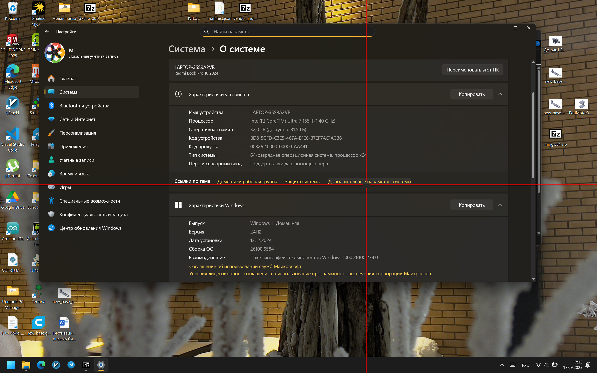

### 3.4 Жмём «Переменные среды»

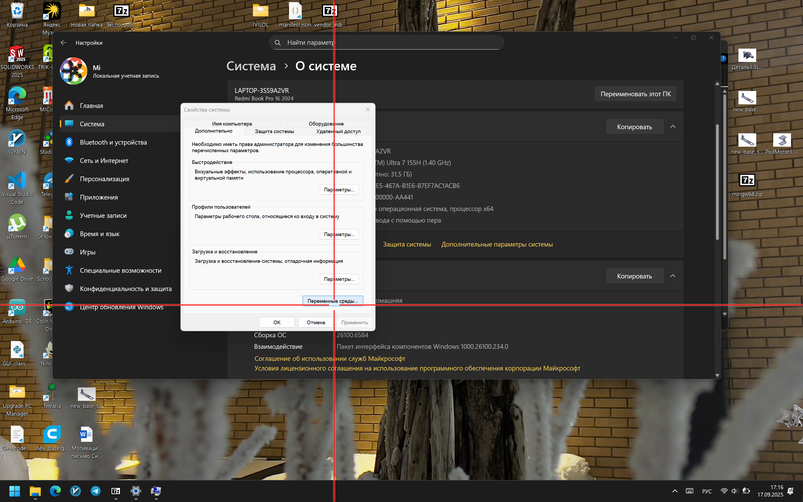

### 3.5 Находим переменную Path

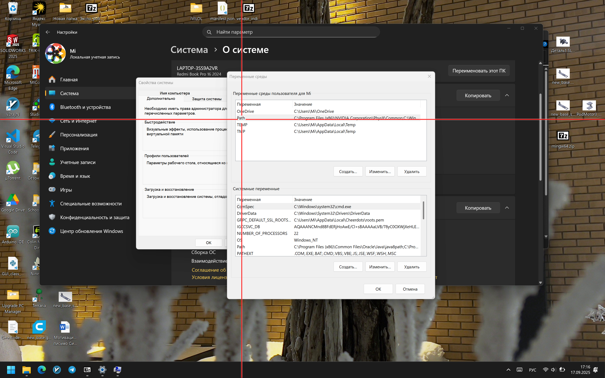

### 3.6 Создаём новый путь

Вставляем путь:

```markdown
C:\mingw64\bin
```

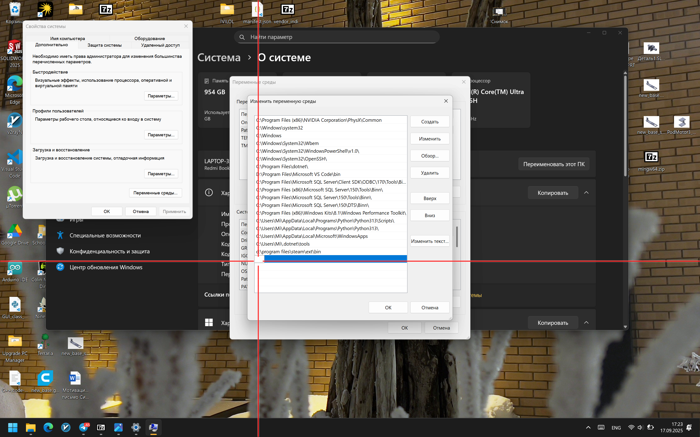

### 3.7 Жмём «Окей»

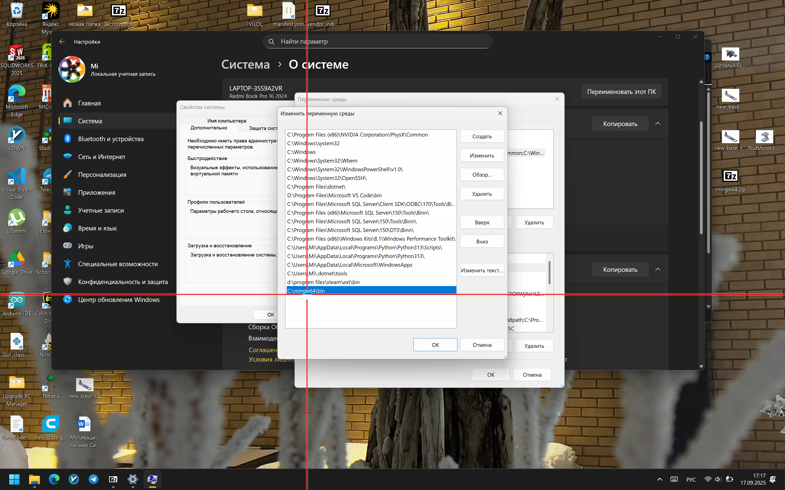

---

## 4. Установка VS Code

Если VS Code у вас ещё нет — скачиваем вот от сюда:  
<https://code.visualstudio.com/download>

---

## 5. Подключаем расширения VS Code

### 5.1 Жмём на шестерёнку


### 5.2 Открываем Profile

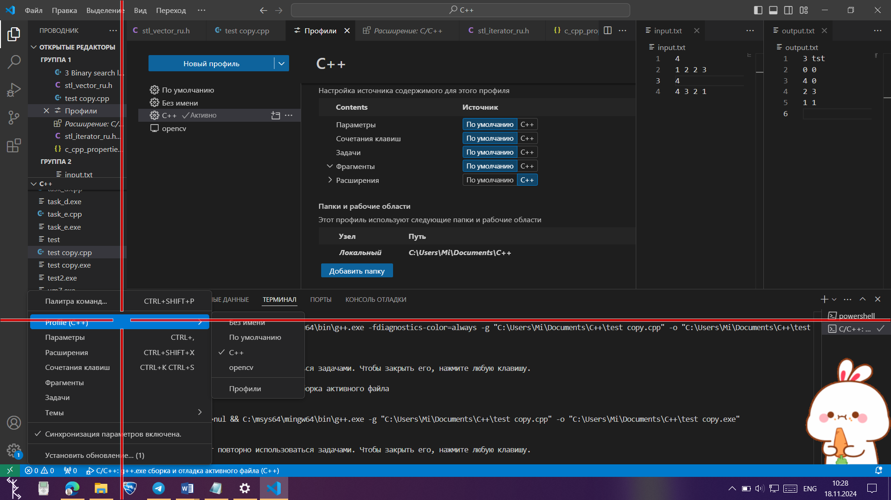

### 5.3 Жмём «Профили»

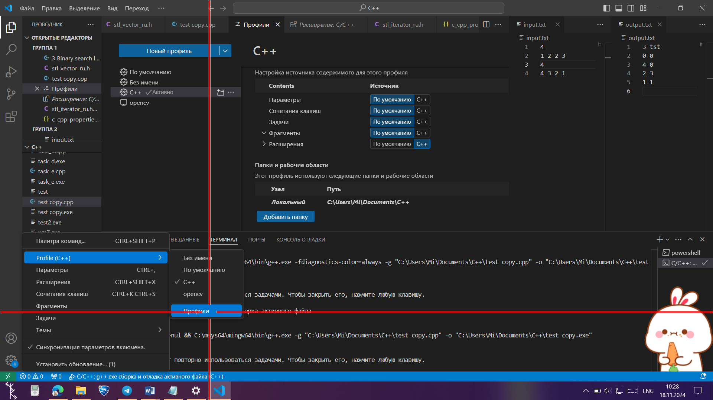

### 5.4 Жмём на стрелочку возле «Новый профиль»

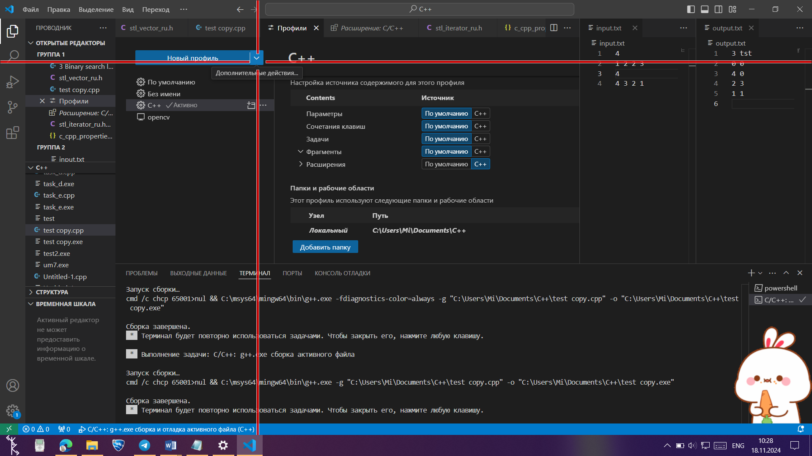

### 5.5 Выбираем «Импорт профиля»

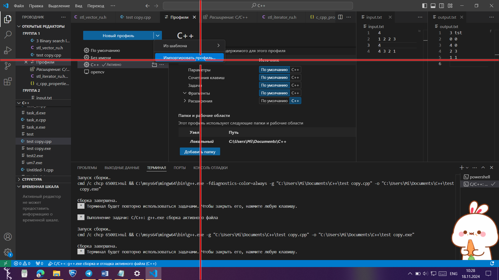

### 5.6 Находим файл `С++.code-profile`


### 5.7 Выбор профиля

- После этого выбираем наш профиль, как в шаге 5.3

---

## 6. Начало работы

Слева сверху найдите **стрелочку запуска** — жмёте её, и всё запускается.

Но, чтобы не оставлять вас тут без полезных ссылок:

- **Как запустить программу?**  
  <https://code.visualstudio.com/docs/cpp/config-mingw#_debug-helloworldcpp>  
  _У них появляется окно сверху при первом запуске — не удивляйтесь, у вас уже настроена папка `.vscode`_

- **Что умеет VS Code?**  
  <https://code.visualstudio.com/docs/editing/codebasics>

---

## 7. Тестовая программа

Я оставил внутри проекта простую тестовую программу **с вводом/выводом через файлы**, можете поэкспериментировать.

---

## 8. Input и Output

Чтобы открыть `input.txt` или `output.txt` в отдельном окне - нажмите сверху на окошко:


---

## 9. Официальный гайд

Там же вы можете узнать, откуда я взял папку mingw64, и причём тут msys, который фигурировал в неправильном пути в настройке зависимости для [win 10](#создание-зависимостей-win-10).

> 🚫 **СТОП!**
> \
> Всё описанное ниже — только для общего развития. Ничего делать не нужно!

прочитав официальный [VS Code C++ гайд](https://code.visualstudio.com/docs/cpp/config-mingw), вы наткнётесь на видео:


и в офф. гайде основным способом предлагают делать через ucrt64, может быть оно и правильнее, но у меня не завелось, так что даже в статье есть команда

``` bash
pacman -S --needed base-devel mingw-w64-x86_64-toolchain
```

для установки компилятора через mingw64, что я вам и предлагаю сделать.
_Что бы запустить команду, вам необходимо установить [MSYS](https://github.com/msys2/msys2-installer/releases/download/2025-08-30/msys2-x86_64-20250830.exe)._

---

## 10. Python!

- Я о вас не забыл, сейчас начнём

### 10.1 Скачиваем python

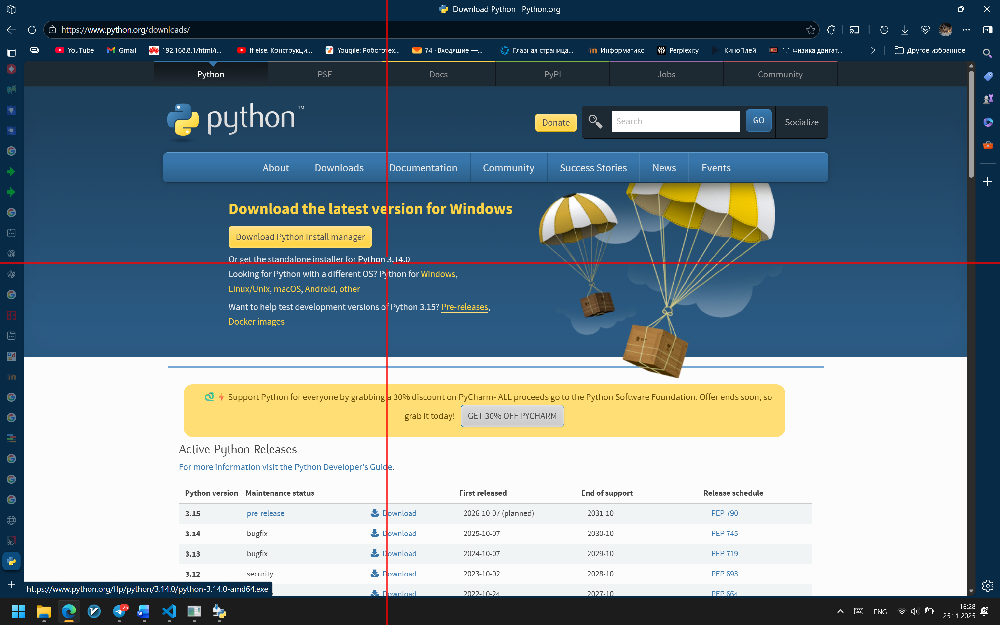
Скачивать установщик с офф. сайта: <https://www.python.org/downloads/>

### 10.2 Запускаем установщик

### 10.3 Выбираем "Add python.exe to PATH"

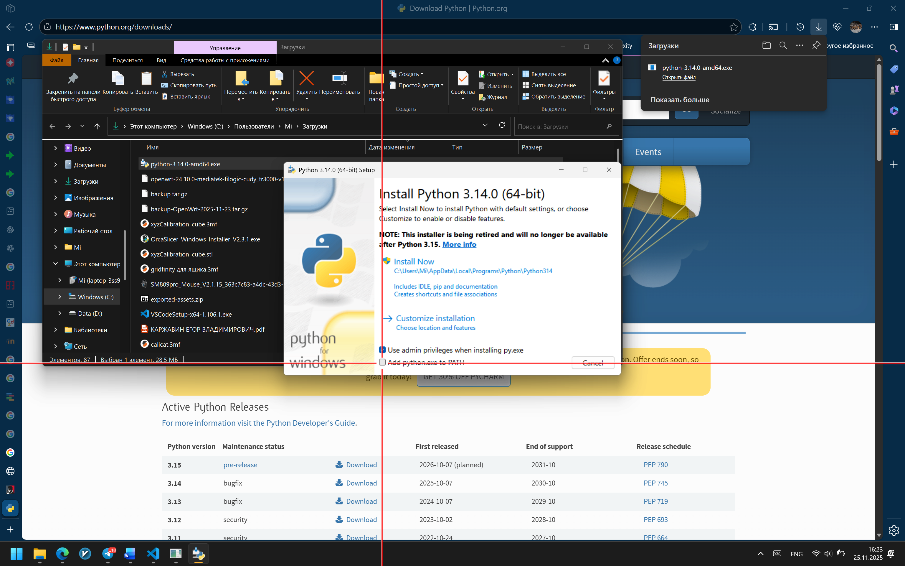
По сути, эта галочка делает всё тоже самое, что и мы в 3 шаге.

### 10.4 Нажимаем "Install now"

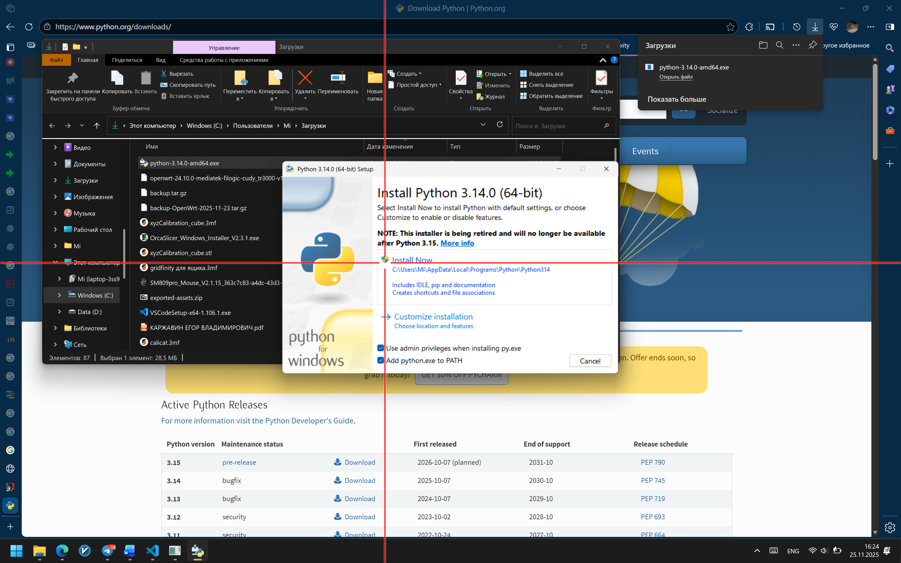
Готово, осталось дождаться конца установки.

## Создание зависимостей (Win 10)

> Полный дубль [шага 3](#3-создание-зависимостей-win-11), только для Win 10.

### 3.1 ПКМ по "Этот компьютер"

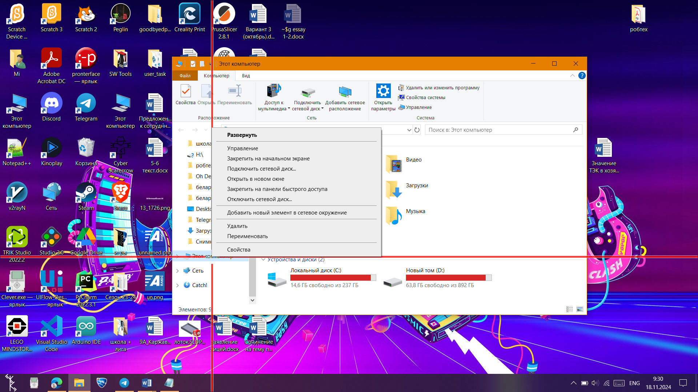

### 3.2 Свойства


### 3.3 Дополнительные параметры системы

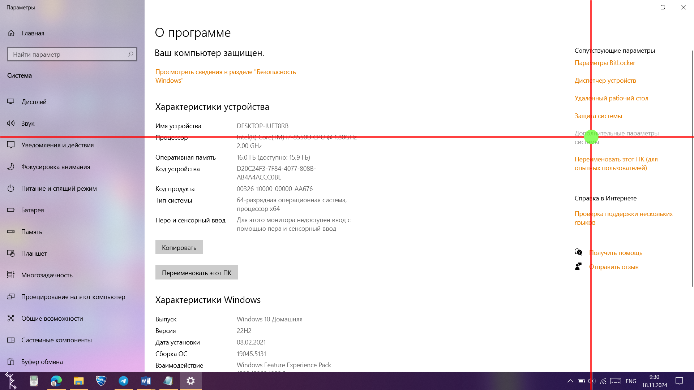

### 3.4 Переменные среды


### 3.5 Path


### 3.6 Вставляем путь

``` markdown
C:\mingw64\bin
```


### 3.7 Жмём «Ок»

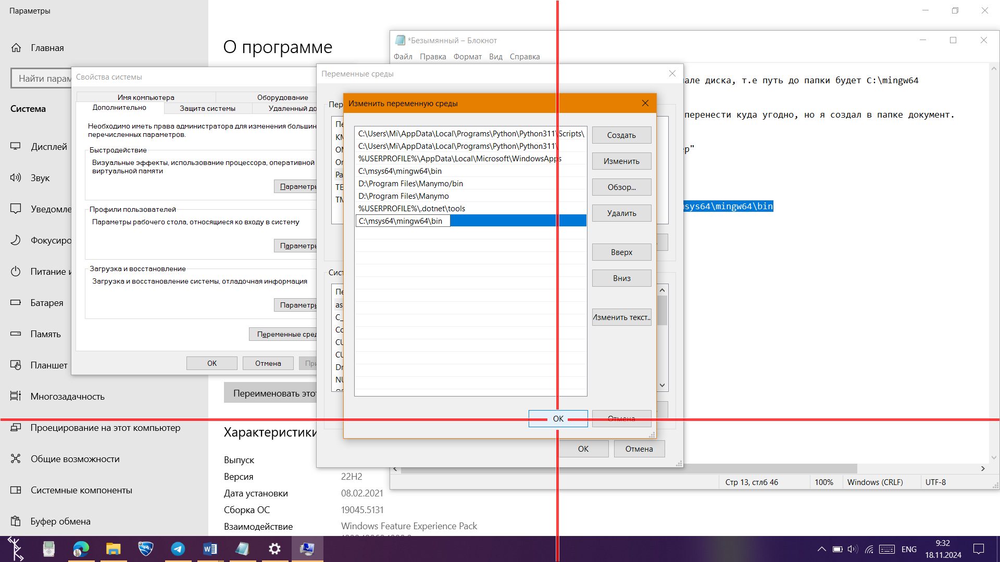

> [!NOTE]  Обратите внимание!
> На картинке путь другой — это ОК.  
> Правильный путь указан в пункте **3.6**.

---

# Уточнения и полезности

## Компилятор

Если вы уже кое-что умеете — можете скачивать компилятор [отдельно](#9-официальный-гайд).
Если нет — используйте архив **«Гайд по C++»**.

## Корень диска

Это папка, которая находиться в самом начале диска, т.е. в нашем случае путь будет

```markdown
C:\mingw64
```

## Путь

Пример корректного пути:

```markdown
C:\test\hey\kek\
```

Полностью на английском.

- Так же, наверное стоит упомянуть, что если вы переносите папку на системный диск (например, в папку документы), то нужно что бы и имя пользователя было на английском. Вот [инструкция](https://www.sravni.ru/text/izmenit-imya-polzovatelya-в-windows-10/), как сменить имя пользователя, даже есть у вас не активирована windows.

## Проблема русских букв

Кому вдруг стало интересно, почему автор так невзлюбил их?! Все дело в кодировке UTF-8, чтобы можно было использовать русские символы и всё работало относительно стабильно, нужно включить бета версию поддержки всех языков мира, но некоторые другие программы, просят это выключить. Вывод, проще не включать это и сделать всё на английском.

> _Серьёзно: избегайте русских букв. Они ломают половину вселенной и дебаггер VS Code одновременно :)_

---

## Немного о проблемах и их решениях

### Debugger работает, а breakpoints игнорируются?

- Попробуйте закомментировать лишние функции

- Удалите мусор (включая комментарии)

- Попробуйте другой файл

- Создайте новую папку и скопируйте в неё `.vscode`, для корректной проверки тестового файла

### Не отображаются переменные в locals в процессе дебага?

1. Находим переменную, которая нам нужна
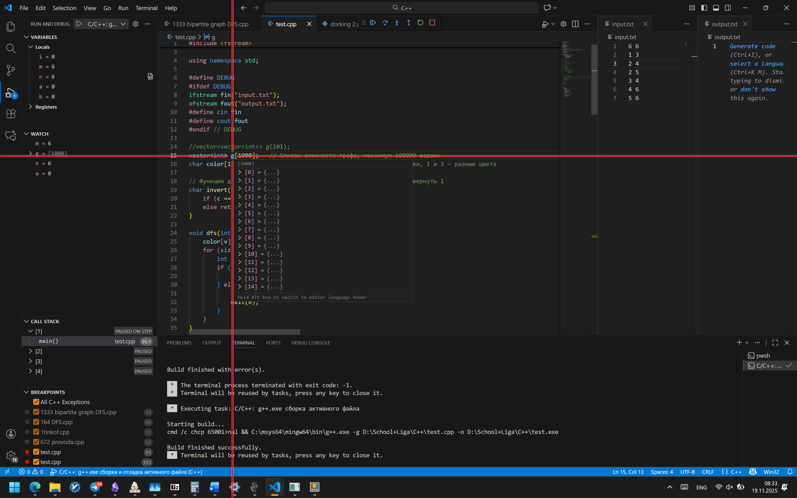
2. ПКМ → «add to watch»  
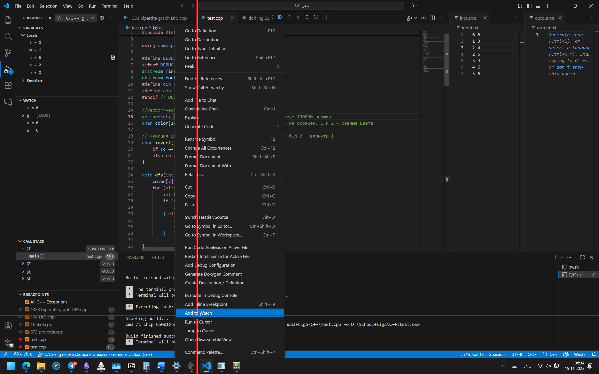
3. Открываем боковую вкладку со стрелочкой и жуком, там надо найти "WATCH"
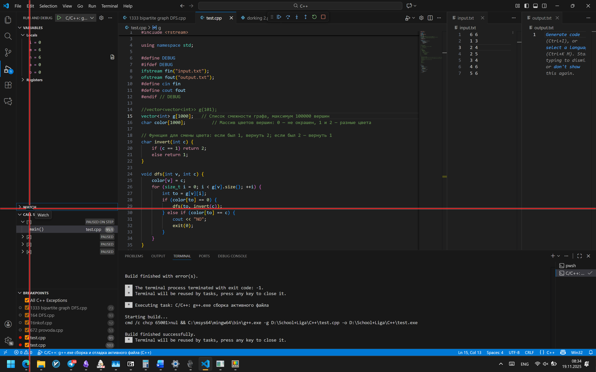
4. Теперь у нас отображается потерянная переменная!
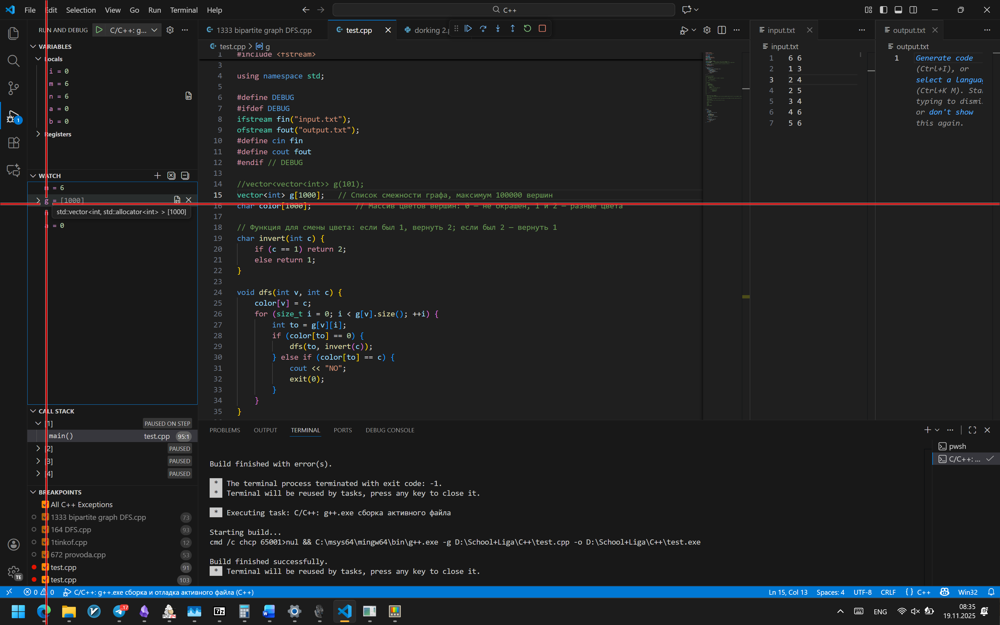

---

### Пропала кнопка запуска?

Варианты решения:

1. Отключите/удалите недавно установленные расширения
2. Создайте новый профиль(почти как в [5 шаге](#5-подключаем-расширения-vs-code)) расширений и проверьте там

---
\
\
\
\
\
\
.
# INSTRUCTION

[RU](#инструкция) / [EN](#instruction)

---

This instruction will help you install the compiler **for both C++** and **Python**, as well as configure VS Code so that everything works on the first try (well… or almost 😄).

---

## 1. Unpack the archive

> Download the .zip archive **"Guide for C++"**, which can be accessed via the link:
> [https://disk.yandex.ru/d/3oVxqH7gDGZTqg](https://disk.yandex.ru/d/3oVxqH7gDGZTqg)

After downloading:

- Move the **mingw64** folder to the **[root of the disk](#root-of-the-disk)**

## 2. Move the project folder

The project folder can be placed **anywhere**, but the [path](#path) must be in English. (folder `your project`)

_You can name the folder however you like, but it's also recommended to use **[English](#problem-with-russian-letters)** to avoid problems._

---

## 3. Creating dependencies (Win 11)

> If you have **[Windows 10](#creating-dependencies-win-10)**, scroll down

### 3.1 Right-click “This PC”


### 3.2 Click “Properties”


### 3.3 Open “Advanced system settings”


### 3.4 Click “Environment Variables”


### 3.5 Find the Path variable


### 3.6 Create a new path

Insert the following path:

```markdown
C:\mingw64\bin
```


### 3.7 Click “OK”


---

## 4. Installing VS Code

If you don’t have VS Code yet — download it from here:
[https://code.visualstudio.com/download](https://code.visualstudio.com/download)

---

## 5. Connect VS Code extensions

### 5.1 Click the gear icon


### 5.2 Open Profile


### 5.3 Click “Profiles”


### 5.4 Click the arrow next to “New Profile”


### 5.5 Select “Import Profile”


### 5.6 Locate the file `С++.code-profile`


### 5.7 Profile selection

- Then select our profile, as in step 5.3

---

## 6. Getting started

Find the **run arrow** at the top left — click it, and everything will start.

But so you don’t leave without helpful links:

- **How to run a program?**
  [https://code.visualstudio.com/docs/cpp/config-mingw#_debug-helloworldcpp](https://code.visualstudio.com/docs/cpp/config-mingw#_debug-helloworldcpp)
  _They get a window at the top on the first launch — don’t be surprised, you already have the `.vscode` folder configured._

- **What can VS Code do?**
  [https://code.visualstudio.com/docs/editing/codebasics](https://code.visualstudio.com/docs/editing/codebasics)

---

## 7. Test program

I left a simple test program **with input/output through files** inside the project, feel free to experiment.

---

## 8. Input and Output

To open `input.txt` or `output.txt` in a separate window — click the window icon at the top:


---

## 9. Official guide

There you can also find out where I got the mingw64 folder from, and what msys has to do with all this — the one that appeared in the incorrect path in the dependency setup for [win 10](#creating-dependencies-win-10).

> 🚫 **STOP!**
> \
> Everything described below in this paragraph is only for general knowledge.
> You already handled everything — you don't need to do any of this!

After reading the official [VS Code C++ guide](https://code.visualstudio.com/docs/cpp/config-mingw), you’ll encounter a video:


And in the official guide the main recommended method uses ucrt64 — maybe it’s even better — but it didn’t work for me. So even in the article there is a command

```bash
pacman -S --needed base-devel mingw-w64-x86_64-toolchain
```

to install the compiler through mingw64, which I recommend you do.

_To run the command, you need to install [MSYS](https://github.com/msys2/msys2-installer/releases/download/2025-08-30/msys2-x86_64-20250830.exe)._

---

## 10. Python

### 10.1 Download python


Download installer from official suit: <https://www.python.org/downloads/>

### 10.2 Run installer

### 10.3 Choose "Add python.exe to PATH"


In our case this button work like 3 step, but automatically.

### 10.4 click "Install now"


Done, wait until process end.

## Creating dependencies (Win 10)

> Full copy of [step 3](#3-creating-dependencies-win-11), only for Win 10.

### 3.1 Right-click "This PC"


### 3.2 Properties


### 3.3 Advanced system settings


### 3.4 Environment Variables


### 3.5 click Path


### 3.6 Insert path:

```markdown
C:\mingw64\bin
```


### 3.7 Click "OK"


> [!NOTE] Please note!
> The path in the picture is different — that’s OK.
> The correct path is listed in **3.6**.

---

# Clarifications and useful notes

## Compiler

If you already know a thing or two — you can download the compiler [separately](#9-official-guide).
If not — use the **“Guide for C++”** archive.

## Root of the disk

This is the folder that is located at the very beginning of the drive; in our case the path will be

```markdown
C:\mingw64
```

## Path

Example of a correct path:

```markdown
C:\test\hey\kek\
```

Entirely in English.

- Also, it’s worth mentioning that if you move the folder to the system drive (e.g., Documents), then your username should also be in English.
  Here is an [instruction](https://www.sravni.ru/text/izmenit-imya-polzovatelya-в-windows-10/) on how to change the username, even if Windows is not activated.

## Problem with Russian letters

For those curious why the author dislikes them so much?!
It’s all about UTF-8 encoding. To use Russian characters and keep things more or less stable, you need to enable the beta version of support for all world languages — but some programs require this to be turned off.

Conclusion: It’s easier not to enable this and just make everything in English.

> _Seriously: avoid Russian characters. They break half of the universe and the VS Code debugger at the same time :)_

---

## A bit about problems and their solutions

### Debugger works, but breakpoints are ignored?

- Try commenting out unnecessary functions
- Remove garbage (including comments)
- Try another file
- Create a new folder and copy `.vscode` into it for correct testing

### Variables don’t appear in “locals” during debugging?

1. Find the variable you need
   
2. Right-click → “add to watch”
   
3. Open the sidebar with the arrow and bug, find “WATCH”
   
4. Now the missing variable appears!
   

---

### Run button disappeared?

Possible solutions:

1. Disable/delete recently installed extensions
2. Create a new extension profile and test there
